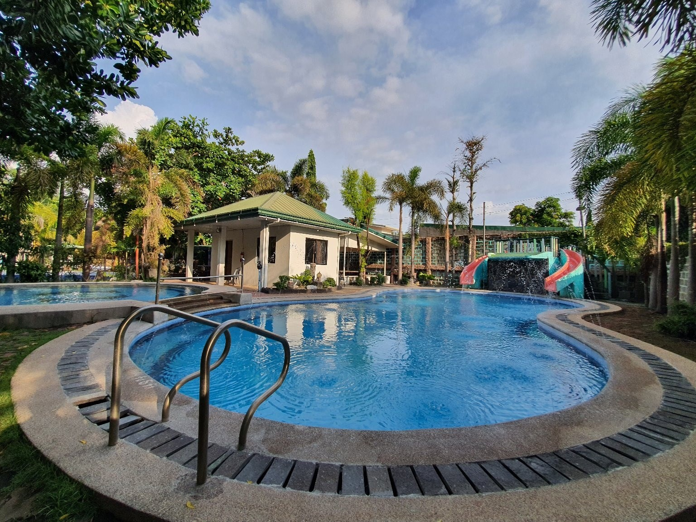

# St. Agnes Function Hall and Resort Website

A modern, responsive website for St. Agnes Function Hall and Resort - a premier destination for events, private villa rentals, and public pool access in the Philippines.



## Features

### Design & UX
- **Video Hero Section** - Full-screen drone footage showcasing the resort
- **Smart Sticky Navbar** - Transparent on hero, becomes solid white on scroll
- **Smooth Scrolling** - Elegant navigation between sections
- **Active Section Highlighting** - Navigation indicates current section
- **Scroll Animations** - Elements fade in as you scroll
- **Lightbox Gallery** - Click any photo to view fullscreen with navigation

### Pages
- **Home** - Hero video, accommodation cards, cottages, photo gallery carousel, rules, contact form, location map
- **Private Villas** - Villa details, amenities, rates, photo galleries
- **Public Pools** - Pool information, day/night/overnight rates
- **Function Hall** - Event space details and gallery
- **Photo Gallery** - Extended image gallery

### Technical Features
- **Form Validation** - Real-time validation with visual feedback (no alerts)
- **Email Integration** - Contact form sends via EmailJS
- **Responsive Design** - Works on desktop, tablet, and mobile
- **Bootstrap 5** - Modern CSS framework
- **Pure JavaScript** - No heavy frameworks, fast loading

## Tech Stack

- HTML5
- CSS3 (with custom animations)
- JavaScript (ES6+)
- Bootstrap 5.3
- EmailJS for contact form
- GitHub Pages ready

## Getting Started

### View Live
Visit: [https://skrtkrt.github.io/St-Agnes-WebDev](https://skrtkrt.github.io/St-Agnes-WebDev)

### Run Locally
```bash
# Clone the repository
git clone https://github.com/Skrtkrt/St-Agnes-WebDev.git

# Navigate to folder
cd St-Agnes-WebDev

# Open in browser (or use Live Server in VS Code)
# Or use Python simple server:
python -m http.server 8080
```
Then visit `http://localhost:8080`

## Project Structure

```
St-Agnes-WebDev/
├── index.html              # Main homepage
├── privateVillas.html      # Private villas page
├── publicPools.html        # Public pools page
├── functionHall.html       # Function hall page
├── photogallery.html       # Extended gallery
├── css/
│   ├── style.css          # Main stylesheet
│   ├── privateVillas.css  # Villas page styles
│   ├── publicPools.css    # Pools page styles
│   ├── functionhall.css   # Function hall styles
│   └── photogallery.css   # Gallery styles
├── js/
│   ├── index.js           # EmailJS integration
│   ├── scrollAnimation.js # Scroll effects & lightbox
│   ├── script.js          # Carousel functionality
│   └── photogallery.js    # Gallery scripts
└── img/                   # All images and videos
```

## Key Improvements Made

1. **Smart Navbar** - Changes from transparent to solid on scroll
2. **Lightbox Gallery** - Fullscreen image viewing with keyboard navigation
3. **Form Validation** - Real-time validation with visual feedback
4. **Smooth Scrolling** - Enhanced navigation experience
5. **Active Section Indicators** - Shows current section in navigation
6. **Mobile Responsive** - Optimized for all screen sizes

## Browser Support

- Chrome/Edge (latest)
- Firefox (latest)
- Safari (latest)
- Mobile browsers (iOS Safari, Chrome Mobile)

## Contact

**St. Agnes Function Hall and Resort**
- Facebook: [facebook.com/stagnesfunctionhallandresort](https://www.facebook.com/stagnesfunctionhallandresort)
- Location: Philippines

---

© 2023 St. Agnes Function Hall and Resort. All rights reserved.
